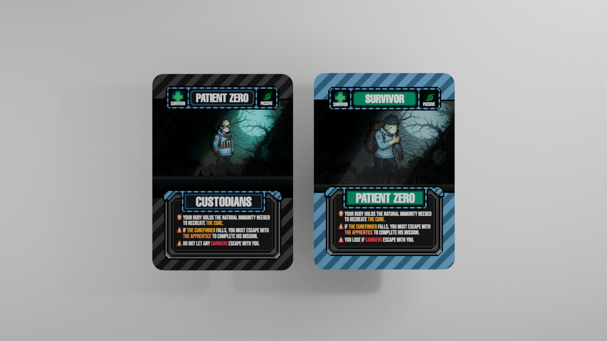
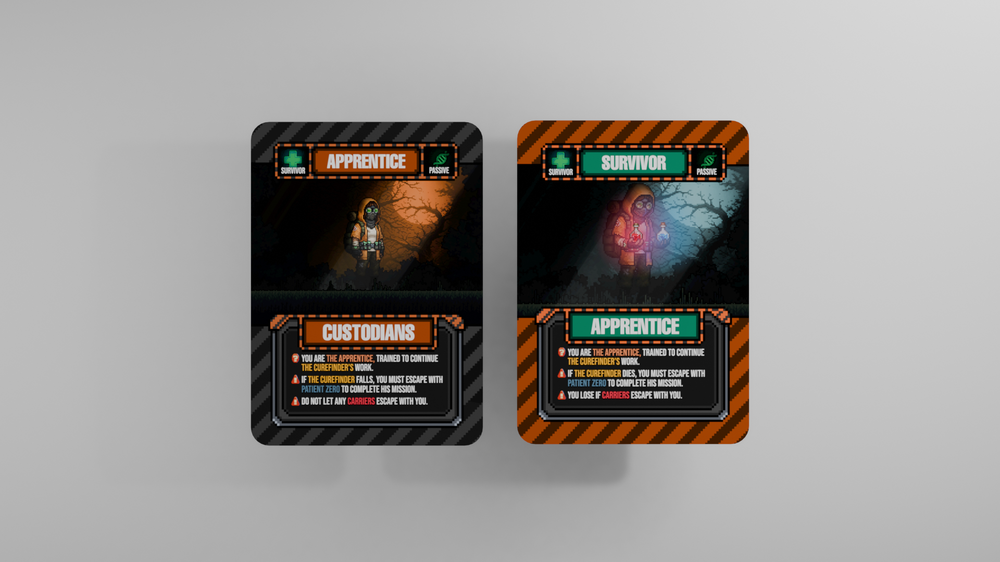
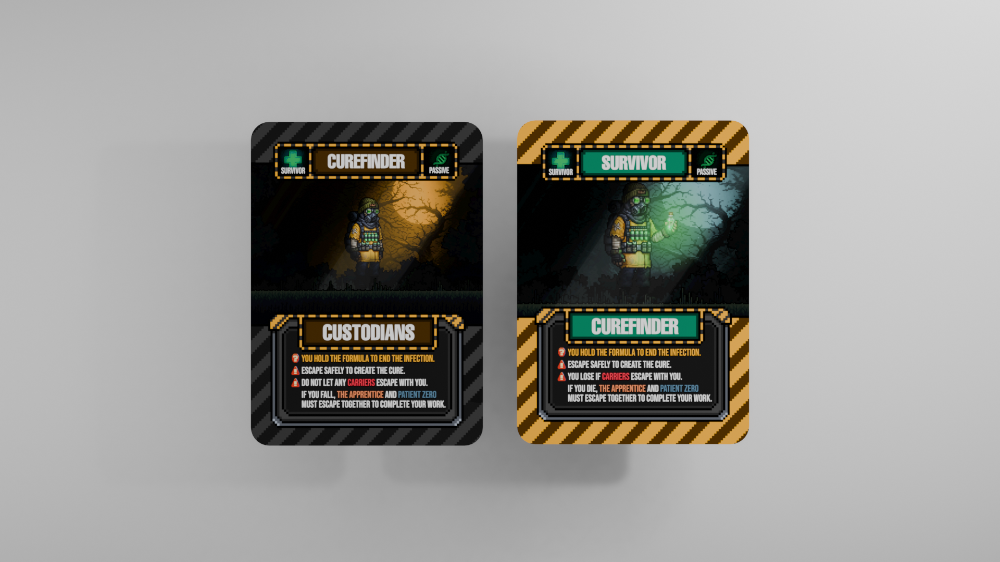
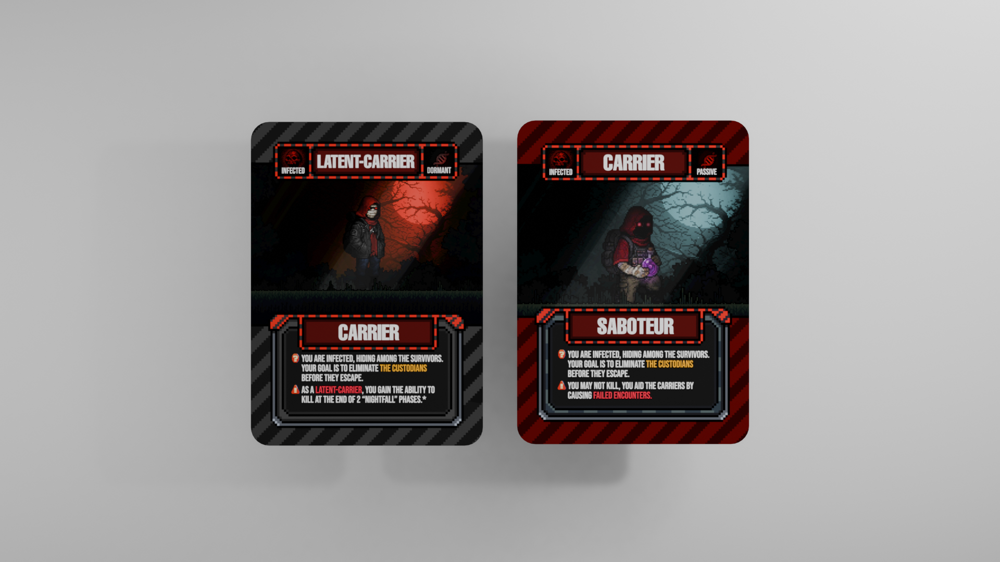

Two changes to the secret roles this week, both based on player feedback.

## Simpler Sides

Every secret role used to belong to its own named team — Custodians, and a few others — which meant new players had to learn a team name **and** a role name before they even understood what side they were on. That's one layer of confusion too many.

From now on, there are just two sides: **Survivors** and **Carriers**. The top banner tells you your side at a glance, and the bottom banner still names your specific role, like Patient Zero or Curefinder, so nothing is lost — it's just easier to read at the table.

, the Carrier Secret Role, now labeled the same simple way")

## Less Static Poses

We also noticed the secret role art was starting to blend together — several characters stood in nearly the same stance, just recolored. It made cards easy to mix up on the table and didn't do justice to who these characters are.

Each role is getting its own pose going forward — different stances, different body language — so the cards read as distinct characters instead of palette swaps of the same figure.

More of this as the redesigned deck comes together. Stay tuned.
