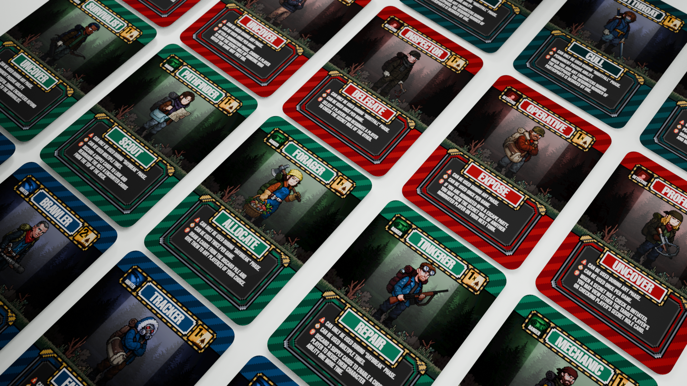
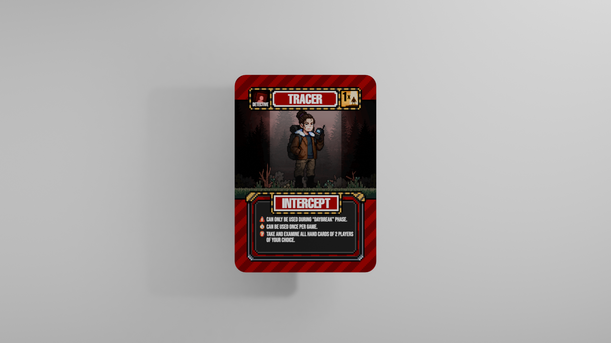
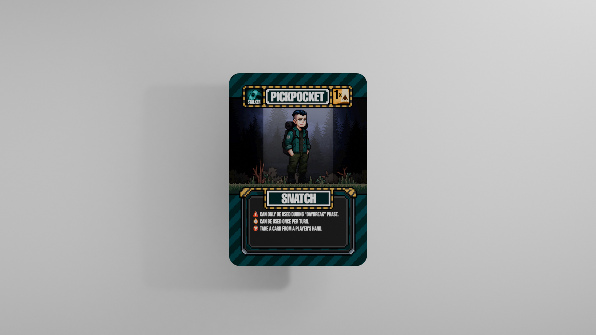
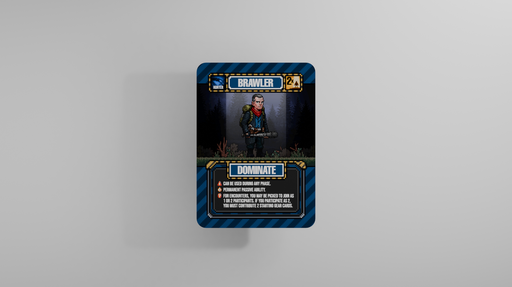
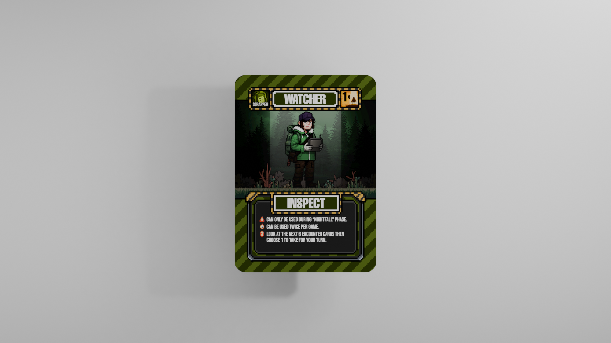
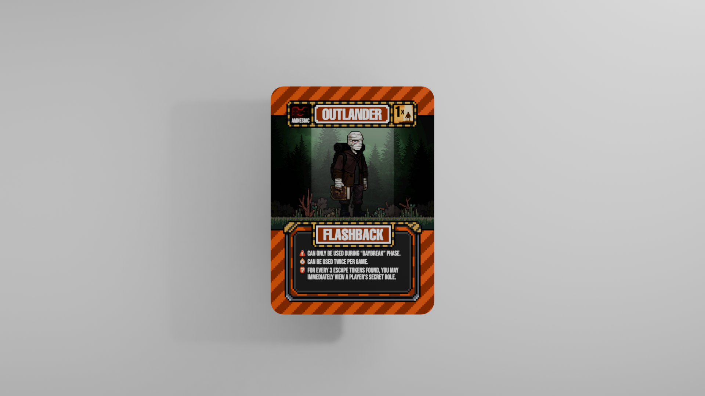
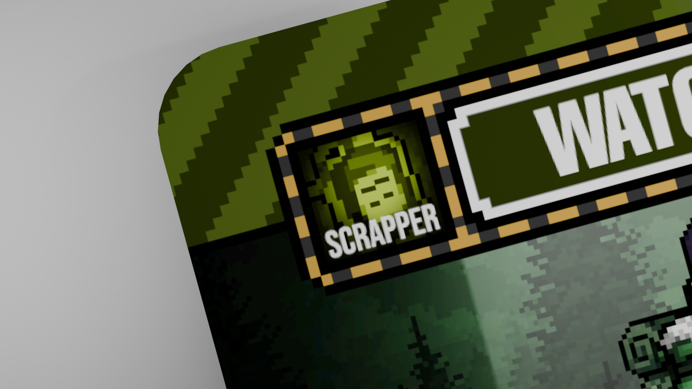
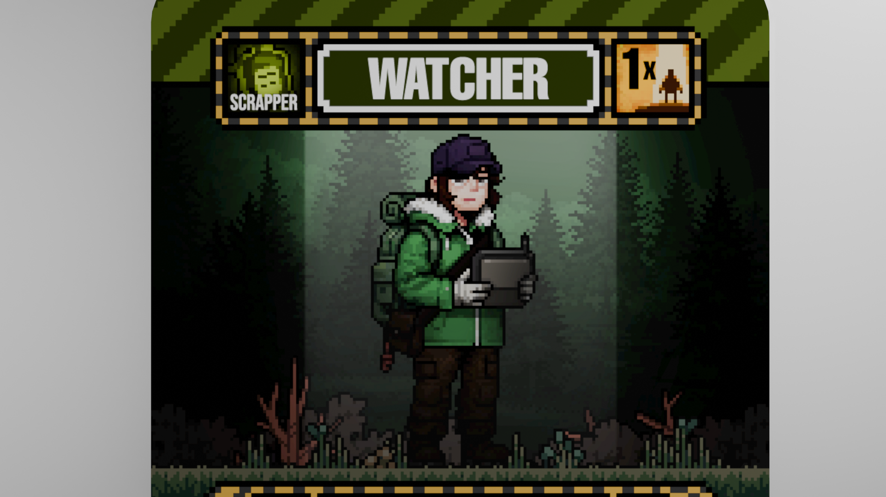
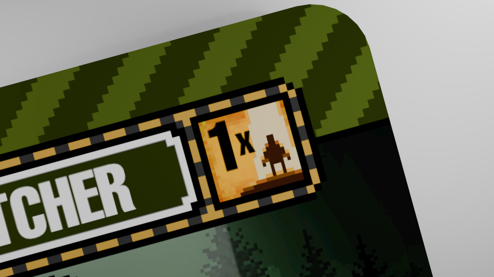
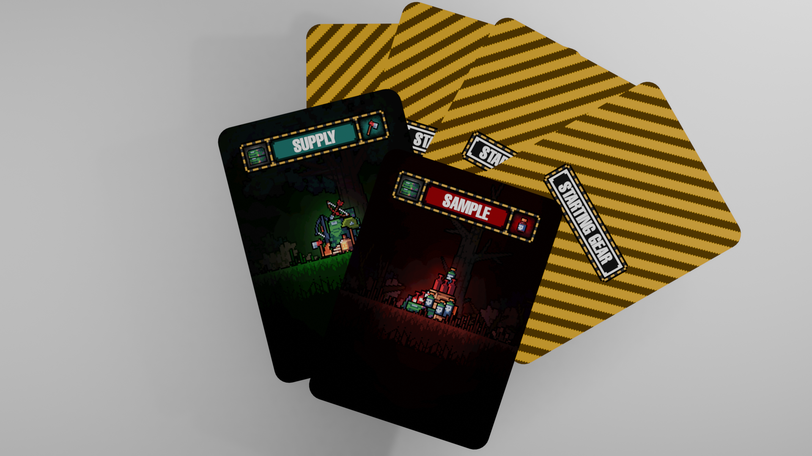

During a playtest session with Version 3, we kept expanding the characters. More classes, more abilities, more variety — it felt like progress at the time.

Then we laid them all out on the table.

Turns out "more" wasn't the same as "better." A lot of these characters were doing versions of the same thing with a different coat of paint. Different name, different flavor text, same job at the table. New players couldn't keep track of who did what, and honestly, neither could we half the time.

Of course, there were good Characters like the Tracer, who has been tested and refined more as we playtested — Characters we were confident in.

But there's also new ones, like the Pickpocket, who seems basic — just take someone's card each turn, right? But what if, in the end game, everyone is severely drained of supplies and the Pickpocket is a Carrier actively stealing from the good players, turning the game into one of attrition? That was not very fun.

Of course, it's through experimenting that we can find Characters that work, with abilities that are fair and helpful regardless of which side you're on. That's the essence of Carrier: no matter which side you're on, Carrier or Survivor, your odds of winning shouldn't be affected.

It's through this testing that we actually found unique new ways of solving problems. The Brawler, for one, was specifically implemented for lower player counts, because if you've only got so many players, a player who counts as 2 participants changes a lot — it also encourages players to actually give out their limited supplies, but you have to build trust first. That changed the dynamic; it was way too static previously, with everyone just surviving on their own, and we wanted to implement even more characters that required teamwork.

But we also have classes like The Scrapper class, which leaned too close to our OG class, The Rangers, to really distinguish itself as a unique class of its own — turning it into a replica of existing Characters with small differences, and making it feel really redundant.

However, that is also exactly why we want to change things up. Merging the characters who are too similar, removing those who truly feel like they are not impactful, and, most importantly, cutting what's NOT FUN.   Our goal, at the end of the day, is to ensure every character you get doesn't make you feel like you can't contribute to a game.   On top of redesigning Characters' abilities, because of the plans to overhaul the battle mechanics, we also need to consider how the current indicators work.

Currently, with 8 different classes, we definitely foresee that some are going to be removed, and merged into more meaningful groupings.

Of course, just like the Secret Roles, we also want to change up the poses of some of the Characters, making them more dynamic and unique.

Currently, in V3, all encounters read out exactly how many participants are required for any given encounter — we want to change that. If a group encounters a Horde of zombies, it makes sense to want more players to participate, so why are we limiting it to 5 participants only, when your group has 8 people? It makes sense that you would want to send everyone, but what the player would have to consider is that all players and resources are limited — you must take the risk while minimising the danger to the group. This new mechanic is still being worked on, and will be updated soon on the Dev Journal, but essentially, this change would make the Participant Indicator Icon obsolete.

Another benefit to changing the participants is that we remove over 72 cards (3 supply + 3 Samples for each player) from the game, removing a "fixed" hand. Players will instead be given a whole new way of resolving Encounters.
